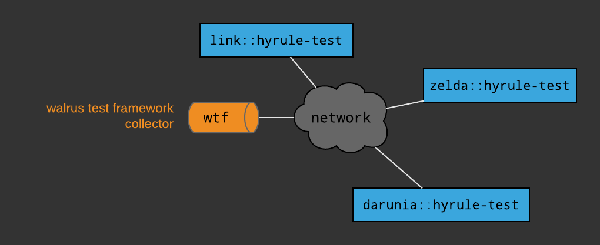
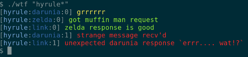

# Walrus Testing Framework

|  |
|:---:|
| <sup><sub> Artwork courtesy of Tien-Hsin Cindy Wu </sub></sup> |

wtf is a simple testing framework for distributed systems. The basic thing that it does is allow disparate programs within a distributed system to record test results to a centralized location. Bindings for a number of languages are provided. 

Consider the example below. <br />


This small system comes packaged up in the examples directory. In this system there are 3 programs running on 3 computers named after famous Zelda characters. Each is written in a different programming language, Link in C, Zelda in Python and Darunia in Perl. Test programs for each of the participants have been written in the unit testing style. However, in this case the test results are being set over the network to the wtf collector. Once a test is completed there is a command line utility called `wtf` to view the results of a distributed test.

Here are some code fragemnts from each of the three lanaguages using wtf.

### C
```c
#include <wtf/walrus.h>
struct WTFTest t = {
  .collector = "192.168.147.100", 
  .test = "hyrule", 
  .participant = "link",
  .counter = 0
};

/// ... other testing ...

else if(strncmp(expected, response, len) != 0)
{
  WTFerror(&t, "unexpected zelda response `%s`", response);
}
```

### Python
```python
import walrus
wtf = walrus.Test('192.168.147.100', 'hyrule', 'zelda')

### ... other testing ...

if msg != 'do you know the muffin man?':
    wtf.error('unexpected message: %s'%msg)
```

### Perl
```perl
use Walrus;
my $wtf = Walrus->new('192.168.147.100', 'hyrule', 'darunia');

### ... other testing ...

if ($msg eq "do you know the mUfFiN MaN?")
{
  $wtf->ok("expected message recv'd");
}
```

And then using the `wtf` command line application, test results can be viewed like so



## Design
The design of wtf is extremely simple. The collector is just a [Redis](https://redis.io) database and each language comes with a driver that implements an initializer and 3 functions.

```
init(collector-address, test-name, participant-name)
error(message)
warning(message)
ok(message)
```

The language drivers follow a common specification in placing test diagnostics in the Redis database and that's it!

If you are interested in the details of specification that defines how test diagnostics are placed in the Redis database see [dspec](doc/dspec.md).
